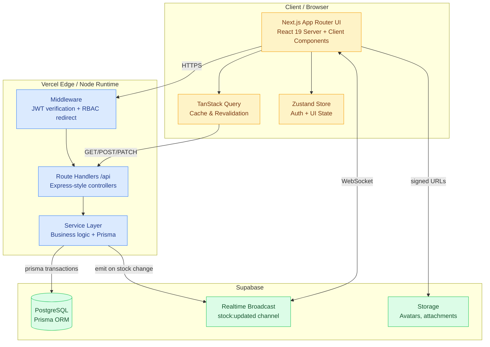
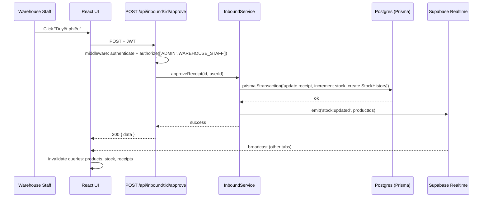
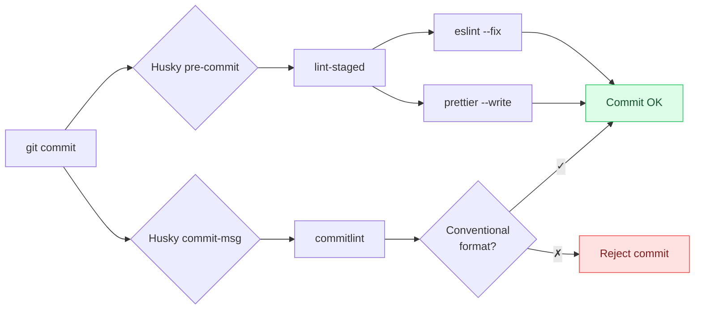
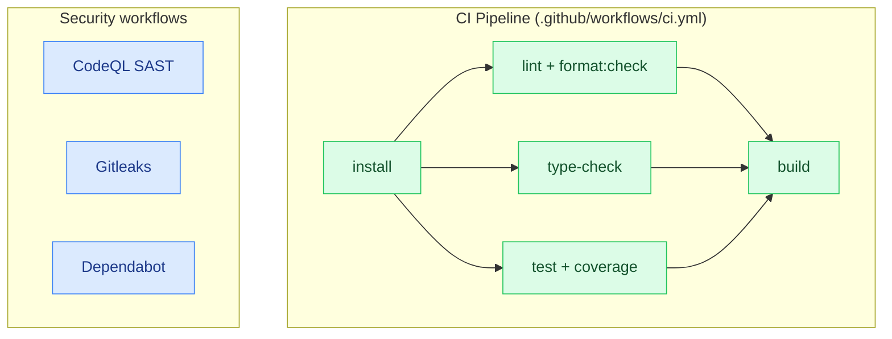

<div align="center">

# 🏭 Warehouse Management System (WMS)

**Hệ thống quản lý kho hiện đại cho logistics cửa khẩu** — full-stack TypeScript monorepo với Next.js 16, Prisma, Supabase và realtime stock tracking.

[](https://github.com/SecondNot2/WMS/actions/workflows/ci.yml)
[](https://github.com/SecondNot2/WMS/actions/workflows/codeql.yml)
[](https://github.com/SecondNot2/WMS/actions/workflows/gitleaks.yml)
[](https://vitest.dev/)
[](https://github.com/prettier/prettier)
[](https://conventionalcommits.org)
[](https://opensource.org/licenses/MIT)

[](https://nextjs.org/)
[](https://react.dev/)
[](https://www.typescriptlang.org/)
[](https://tailwindcss.com/)
[](https://www.prisma.io/)
[](https://supabase.com/)
[](https://pnpm.io/)


</div>

---

## 📑 Mục lục

- [Quick demo](#-quick-demo)
- [Highlights](#-highlights)
- [Kiến trúc](#%EF%B8%8F-kiến-trúc)
- [Tech stack](#-tech-stack)
- [Tính năng nghiệp vụ](#-tính-năng-nghiệp-vụ)
- [Phân quyền (RBAC)](#%EF%B8%8F-phân-quyền-rbac)
- [Cấu trúc monorepo](#-cấu-trúc-monorepo)
- [Cài đặt & chạy local](#%EF%B8%8F-cài-đặt--chạy-local)
- [Lệnh phát triển](#%EF%B8%8F-lệnh-phát-triển)
- [Testing & chất lượng code](#-testing--chất-lượng-code)
- [CI/CD](#-cicd)
- [Deploy](#-deploy)
- [License](#-license)

---

## 🚀 Quick demo

> **3 cách trải nghiệm WMS** — chọn cách phù hợp:

| Cách                        | Lệnh                                          | Yêu cầu                        |
| --------------------------- | --------------------------------------------- | ------------------------------ |
| **🐳 Docker self-host**     | `docker compose --env-file .env.docker up -d` | Docker Desktop                 |
| **💻 Dev local**            | `pnpm install && pnpm dev`                    | Node 20, pnpm 10, Supabase URL |
| **📖 Interactive API docs** | Mở `/api-docs` sau khi server chạy            | Trình duyệt                    |

---

## ✨ Highlights

- 🏗️ **Monorepo**: pnpm workspaces + Turborepo 2 với cached pipeline (lint/type-check/test/build)
- ⚡ **Single-deploy**: API Route Handlers chạy chung Next.js app — không cần backend server riêng, deploy 1 lần lên Vercel hoặc Docker
- 🔒 **Auth**: JWT access (15m) + refresh (7d) với rotation, RBAC 3 roles
- 📦 **Stock realtime**: Mọi thay đổi tồn kho đẩy qua Supabase Broadcast, UI cập nhật tức thì không cần refresh
- 💎 **Type-safe end-to-end**: Zod schemas dùng chung giữa client validation, server validation, và TypeScript types
- 🧪 **Tested**: 62 unit tests (Vitest) — services, utilities, RBAC, JWT lifecycle, URL safety
- ✅ **Quality gates**: Husky + lint-staged + Prettier + ESLint + Commitlint, 4 GitHub Actions workflows
- 🛡️ **Secure-by-default**: Gitleaks secret scanning, CodeQL SAST, Dependabot, Next.js Middleware route protection
- 📖 **Interactive API docs**: OpenAPI 3.1 auto-generated từ Zod schemas, served qua Scalar UI tại `/api-docs`
- 🌐 **Vietnamese UI**: Tất cả label, error messages tiếng Việt; designed cho user thực tế

---

## 🏛️ Kiến trúc



### Data flow — duyệt phiếu nhập (transaction)



---

## 🧰 Tech stack

| Layer         | Tech                                                 | Notes                                                          |
| ------------- | ---------------------------------------------------- | -------------------------------------------------------------- |
| **Runtime**   | Node 20 LTS, pnpm 10                                 | Single package manager, frozen lockfile in CI                  |
| **Framework** | Next.js 16 App Router, React 19                      | Server Components by default, `"use client"` opt-in            |
| **Styling**   | Tailwind CSS 4                                       | `@theme` CSS variables, no hardcoded hex                       |
| **State**     | Zustand 5 (UI), TanStack Query 5 (server cache)      | Strict separation, no `useEffect` for fetching                 |
| **Forms**     | React Hook Form + Zod 4                              | Schemas shared with backend via `@wms/validations`             |
| **Backend**   | Next.js Route Handlers                               | Single deployment, no separate Express server                  |
| **ORM**       | Prisma 5                                             | `prisma migrate deploy` runs automatically on Vercel           |
| **Database**  | Supabase Postgres                                    | Pooled (`6543`) for app, direct (`5432`) for migrations        |
| **Auth**      | JWT access (15m) + refresh (7d)                      | bcryptjs, custom token rotation, Next.js Middleware guard      |
| **Realtime**  | Supabase Realtime Broadcast                          | `stock:updated` channel after every inventory mutation         |
| **Logging**   | Winston                                              | Structured JSON logs, no `console.log` in services             |
| **Charts**    | Recharts 3                                           | Inventory donut, shipment combo, performance trends            |
| **Icons**     | Lucide React                                         | Tree-shakeable, ~1KB per icon                                  |
| **Excel**     | xlsx                                                 | Server-side generation for reports                             |
| **Testing**   | Vitest 4 + jsdom + @testing-library/react            | 46 tests, v8 coverage, mocked Prisma client                    |
| **Quality**   | ESLint, Prettier 3, Commitlint, lint-staged, Husky 9 | Auto-format on commit, conventional commits enforced           |
| **CI/CD**     | GitHub Actions, Vercel, Turborepo 2                  | Cached pipeline, parallel jobs, FULL TURBO replay on cache hit |
| **Security**  | CodeQL, Gitleaks, Dependabot                         | Weekly SAST + secret scan + dep updates                        |

---

## 📦 Tính năng nghiệp vụ

| Module           | Endpoints                                    | Highlights                                                  |
| ---------------- | -------------------------------------------- | ----------------------------------------------------------- |
| **Sản phẩm**     | `/api/products`, `/api/products/import`      | CRUD, bulk Excel import, stock adjustment với history audit |
| **Danh mục**     | `/api/categories`                            | Tree structure, validate parent-child cycle                 |
| **Phiếu nhập**   | `/api/inbound`, `/api/inbound/:id/approve`   | Auto-gen mã PNK-YYYY-XXXX, transaction với StockHistory     |
| **Phiếu xuất**   | `/api/outbound`, `/api/outbound/:id/approve` | Validate stock đủ trước approve, transaction multi-item     |
| **Tồn kho**      | `/api/stock`, `/api/inventory/:id/adjust`    | Realtime via WebSocket, low-stock alerts                    |
| **Nhà cung cấp** | `/api/suppliers`                             | Thông tin liên hệ, lịch sử nhập                             |
| **Người nhận**   | `/api/recipients`                            | Khách hàng / đối tác xuất hàng                              |
| **Người dùng**   | `/api/users`, `/api/roles`                   | RBAC matrix, toggle active                                  |
| **Báo cáo**      | `/api/reports/*`                             | Inventory, receipt-issue, top products + Excel export       |
| **Thống kê**     | `/api/statistics/*`                          | Performance, efficiency dashboards                          |
| **Activity log** | `/api/activity-logs`                         | Mọi thao tác mutation đều được audit                        |
| **Settings**     | `/api/settings`                              | Per-key system settings, Admin only                         |

> 📋 Đầy đủ ~53 route handlers được liệt kê ở `docs/API_ENDPOINTS.md`.
> 🔍 **Interactive API docs**: [`/api-docs`](/api-docs) — OpenAPI 3.1 auto-generated từ Zod schemas (13 endpoints chính, dễ mở rộng), render với [Scalar](https://scalar.com).

---

## 🛡️ Phân quyền (RBAC)

| Role                | Quyền                                                                | Use case          |
| ------------------- | -------------------------------------------------------------------- | ----------------- |
| **ADMIN**           | Toàn quyền (CRUD + duyệt + quản lý user/role)                        | Quản lý hệ thống  |
| **WAREHOUSE_STAFF** | CRUD products, categories, inbound, outbound, inventory; xem reports | Thủ kho hàng ngày |
| **ACCOUNTANT**      | Read-only mọi dữ liệu, export Excel reports                          | Kế toán đối soát  |

Quyền được kiểm tra ở **3 lớp**:

1. **Next.js Middleware** (`src/middleware.ts`) — chặn truy cập route trái phép tại edge
2. **Route Handler middleware** (`authenticate → authorize([roles])`) — chặn API call
3. **Frontend `<Can action="...">`** (`src/components/Can.tsx`) — ẩn UI elements không được phép

---

## 📁 Cấu trúc monorepo

```text
wms/
├── apps/
│   └── web/                          ← Next.js 16 app (UI + API + Prisma)
│       ├── src/
│       │   ├── app/
│       │   │   ├── (dashboard)/      ← 12 protected route groups
│       │   │   ├── api/              ← Route Handlers (62 endpoints)
│       │   │   ├── login/
│       │   │   └── middleware.ts     ← JWT guard + role-based redirect
│       │   ├── components/           ← Shared UI components
│       │   ├── lib/
│       │   │   ├── api/              ← Axios client + endpoint wrappers
│       │   │   ├── hooks/            ← TanStack Query hooks
│       │   │   ├── store.ts          ← Zustand stores
│       │   │   └── permissions.ts    ← RBAC matrix
│       │   └── server/
│       │       ├── lib/              ← prisma, jwt, websocket, logger
│       │       ├── middleware/       ← API request handlers
│       │       └── services/         ← Business logic (testable)
│       └── prisma/
│           ├── schema.prisma
│           └── migrations/
├── packages/
│   ├── types/                        ← Shared TypeScript interfaces & enums
│   ├── validations/                  ← Shared Zod schemas
│   └── config/                       ← Shared constants & env config
├── .github/
│   ├── workflows/                    ← ci, codeql, gitleaks
│   ├── dependabot.yml
│   └── PULL_REQUEST_TEMPLATE.md
├── .husky/                           ← pre-commit + commit-msg hooks
├── commitlint.config.mjs
├── .prettierrc.json
├── .gitleaks.toml
└── vercel.json                       ← Single-app deploy config
```

---

## ⚙️ Cài đặt & chạy local

### Prerequisites

| Tool     | Min version | Install                                                      |
| -------- | ----------- | ------------------------------------------------------------ |
| Node.js  | 20 LTS      | https://nodejs.org/                                          |
| pnpm     | 10          | `corepack enable && corepack prepare pnpm@latest --activate` |
| Postgres | 14+         | Hoặc free Supabase project                                   |

### Setup

```bash
# 1. Clone & install
git clone https://github.com/SecondNot2/WMS.git
cd WMS
pnpm install

# 2. Cấu hình môi trường
cp apps/web/.env.example apps/web/.env.local
# Sau đó điền:
#   DATABASE_URL, DIRECT_URL  ← từ Supabase dashboard
#   JWT_SECRET, JWT_REFRESH_SECRET  ← openssl rand -base64 64
#   NEXT_PUBLIC_SUPABASE_URL, NEXT_PUBLIC_SUPABASE_ANON_KEY
#   SUPABASE_URL, SUPABASE_SERVICE_ROLE_KEY

# 3. Khởi tạo DB
pnpm db:generate
pnpm db:push       # First time
# Sau này dùng: pnpm db:migrate

# 4. Chạy dev server
pnpm dev
# → http://localhost:3000
```

---

## 🛠️ Lệnh phát triển

| Lệnh                 | Mô tả                                           |
| -------------------- | ----------------------------------------------- |
| `pnpm dev`           | Khởi động Next.js dev server (Turbopack)        |
| `pnpm build`         | Build production (chạy `prisma generate` trước) |
| `pnpm start`         | Chạy production build                           |
| `pnpm type-check`    | Check TypeScript toàn repo                      |
| `pnpm lint`          | Chạy ESLint                                     |
| `pnpm format`        | Format toàn repo bằng Prettier                  |
| `pnpm format:check`  | Check format không apply                        |
| `pnpm test`          | Chạy Vitest suite (46 tests)                    |
| `pnpm test:watch`    | Vitest watch mode                               |
| `pnpm test:coverage` | Tests + v8 coverage report (HTML + lcov)        |
| `pnpm db:generate`   | Sinh Prisma client                              |
| `pnpm db:push`       | Push schema (dev only)                          |
| `pnpm db:migrate`    | Deploy migrations (production)                  |

---

## 🧪 Testing & chất lượng code

### Test suite (62 tests, ~8s)

```text
✓ src/lib/utils.test.ts                       (22 tests) cn() merging + isSafeImageUrl XSS guard
✓ src/lib/permissions.test.ts                 (11 tests) RBAC matrix
✓ src/lib/hooks/use-is-mounted.test.ts        (1 test)   SSR-safe mount
✓ src/server/lib/errors.test.ts               (10 tests) AppError code → HTTP mapping
✓ src/server/lib/jwt.test.ts                  (7 tests)  Sign/verify, tampering rejection
✓ src/server/services/auth.service.test.ts    (11 tests) login/refresh/getMe/changePassword
                                              ─────────
                                              62 passed
```

Pattern dùng cho service tests: **mock Prisma client với `vi.mock()` ở top-level**, không cần test container DB.

### Quality gates (auto-run trên mỗi commit)



### Conventional Commits

```text
feat(web/products):     add bulk import wizard
fix(api/inbound):       use transaction when approving receipt
refactor(web/hooks):    move auth state to Zustand
test(web/auth):         add 11 service tests with mocked prisma
chore(monorepo):        setup husky + prettier + commitlint
db:                     add StockHistory composite index
ci:                     add gitleaks secret scanning
docs:                   update README with architecture diagrams
```

---

## 🚦 CI/CD

4 GitHub Actions workflows chạy song song:

| Workflow             | Trigger          | Jobs                                       |
| -------------------- | ---------------- | ------------------------------------------ |
| **`ci.yml`**         | Push, PR         | install → (lint, type-check, test) → build |
| **`codeql.yml`**     | Push, PR, weekly | SAST trên TypeScript/JavaScript            |
| **`gitleaks.yml`**   | Push, PR, weekly | Secret scan toàn history                   |
| **`dependabot.yml`** | Weekly           | Auto PR cập nhật npm + GitHub Actions      |



---

## 🚀 Deploy

### Option 1 — Docker self-host (zero external deps)

```bash
# 1. Cấu hình env
cp .env.docker.example .env.docker
# Mở .env.docker, generate JWT secrets:
#   openssl rand -base64 64

# 2. Start stack (web + postgres)
docker compose --env-file .env.docker up -d

# 3. Apply migrations
docker compose --env-file .env.docker exec web \
  node node_modules/prisma/build/index.js migrate deploy --schema apps/web/prisma/schema.prisma

# → http://localhost:3000
```

Image size: ~150MB nhờ Next.js standalone output. Multi-stage build với pnpm cache mount → rebuild incremental nhanh.

### Option 2 — Vercel (managed deploy)

Dự án deploy **một app duy nhất** lên Vercel. Backend (Route Handlers) cùng domain với frontend, không cần Render/Railway riêng.

### Vercel setup

1. Import repo vào [Vercel](https://vercel.com/new)
2. **Root Directory**: giữ là `./`
3. Thêm env vars theo `apps/web/.env.production.example`
4. Deploy. `vercel.json` tự động chạy `prisma migrate deploy` trước build.

`vercel.json` highlights:

```json
{
  "framework": "nextjs",
  "buildCommand": "pnpm --filter @wms/web exec prisma migrate deploy && pnpm --filter @wms/web build",
  "outputDirectory": "apps/web/.next",
  "ignoreCommand": "git diff --quiet HEAD^ HEAD -- apps/web packages pnpm-lock.yaml package.json && exit 0 || exit 1"
}
```

`ignoreCommand` skip rebuild nếu PR chỉ thay đổi `docs/`, `*.md`, `.github/` — tiết kiệm build minutes.

---

## 📄 License

[MIT](./LICENSE) © 2026 SecondNot2

---

<div align="center">

Built with ❤️ for warehouse logistics teams

</div>
